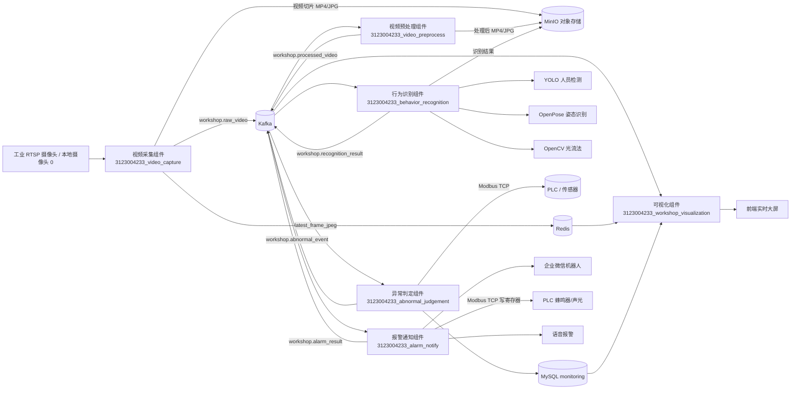
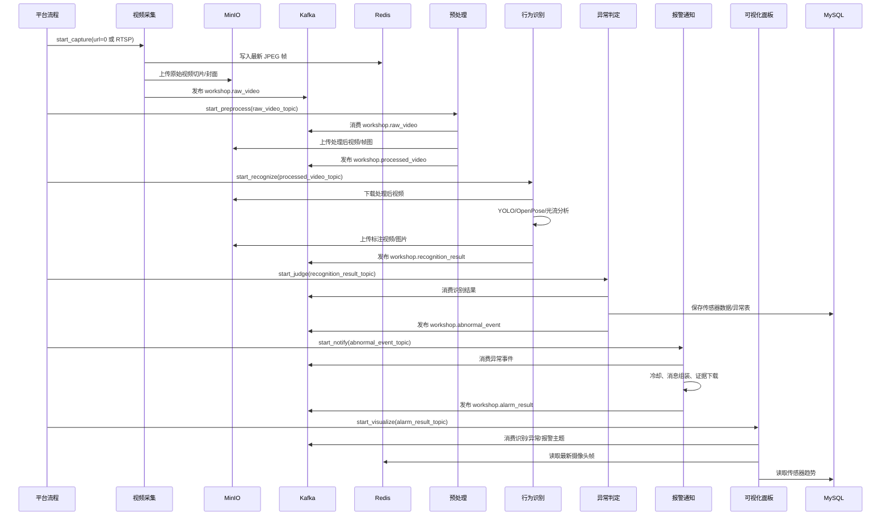
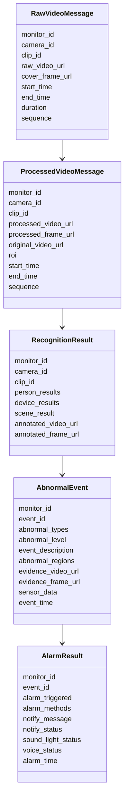
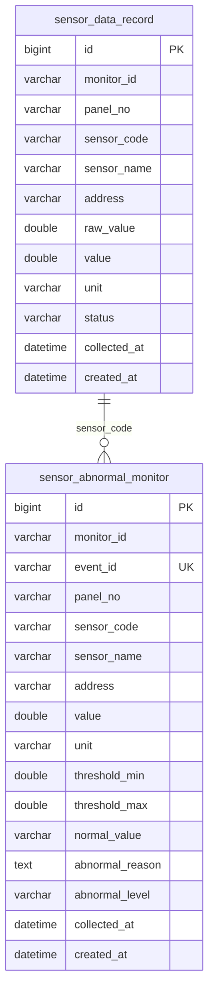

# 车间监测系统开发报告

## 1. 项目概述

本系统面向车间安全监测场景，围绕“视频采集、视频预处理、行为识别、异常判定、报警通知、可视化展示”构建了 6 个业务组件，并接入 MySQL、Redis、Kafka、MinIO、PLC/Modbus、企业微信机器人等基础设施。

系统当前主要能力包括：

- 接入工业 RTSP 摄像头或本地摄像头。
- 将视频切片上传到 MinIO，并通过 Kafka 驱动后续处理链路。
- 通过 YOLO 辅助人员检测，OpenPose 输出人体关键点，光流法检测设备 ROI 震动。
- 根据规则判断人员静止、跌倒、倒地无动作、弯腰/蹲下、离岗、聚集、奔跑、挥手求助、设备震动、传感器阈值异常。
- 通过企业微信机器人发送报警文字、证据图片、证据视频。
- 可选调用 PLC 蜂鸣器/声光报警和语音播报。
- 提供实时可视化面板，展示摄像头画面、异常红框、事件统计、事件列表、报警列表、实时传感器数据和趋势图。

## 2. 技术架构

### 2.1 总体架构



### 2.2 数据流时序



### 2.3 主要中间件

| 中间件 | 作用 |
| --- | --- |
| Kafka | 组件间异步消息总线，主题包括 `workshop.raw_video`、`workshop.processed_video`、`workshop.recognition_result`、`workshop.abnormal_event`、`workshop.alarm_result` |
| MinIO | 保存原始/处理/标注视频片段和证据图片 |
| Redis | 保存运行状态、异常持续时间、冷却状态、实时摄像头 JPEG 帧 |
| MySQL | 保存传感器实时数据、传感器异常记录 |
| PLC/Modbus TCP | 读取传感器数据，控制蜂鸣器/声光报警 |
| 企业微信机器人 | 报警消息、证据图片、证据视频推送 |

## 3. 组件说明

### 3.1 视频采集组件

组件目录：`3123004233_video_capture`

核心文件：`3123004233_video_capture/operations.py`

职责：

- 接收摄像头输入地址 `url`。
- 支持本地摄像头输入 `0`、`camera://0`、`webcam://0`，也支持 RTSP/HTTP/文件地址。
- 按固定时长切分视频片段。
- 上传原始视频片段和封面图片到 MinIO。
- 发布原始视频消息到 Kafka `workshop.raw_video`。
- 将最新摄像头帧写入 Redis，供可视化组件实时展示。

关键实现：

1. `start_capture` 创建后台采集线程。

源码位置：`3123004233_video_capture/operations.py:30`

```python
source_url = (data or {}).get("url")
_validate_video_url(source_url)
video_source = _parse_video_source(source_url)
monitor_id = (data or {}).get("monitor_id") or _new_monitor_id()
thread = threading.Thread(target=_capture_loop, args=(task,), daemon=True)
thread.start()
```

说明：

- 平台只需要传 `url`。
- 如果是本地摄像头，`url` 传 `"0"`。
- 如果是工业摄像头，`url` 传 RTSP 地址。
- 组件返回 `monitor_id`，后续链路均以该 ID 关联。

2. `_record_clip` 切片保存视频并同步实时帧。

源码位置：`3123004233_video_capture/operations.py:217`

```python
writer = cv2.VideoWriter(str(video_path), cv2.VideoWriter_fourcc(*"mp4v"), fps, (width, height))
...
writer.write(frame)
if now - last_live_frame_at >= 0.15 and _publish_latest_frame(monitor_id, frame):
    last_live_frame_at = now
```

说明：

- 使用 OpenCV `VideoWriter` 持续写入 MP4。
- 每约 0.15 秒将最新画面写入 Redis，降低前端实时监控黑屏概率。

3. `_publish_latest_frame` 写入 Redis。

源码位置：`3123004233_video_capture/operations.py:391`

```python
ok, encoded = cv2.imencode(".jpg", frame, [int(cv2.IMWRITE_JPEG_QUALITY), 78])
conn.set("monitor:%s:latest_frame_jpeg" % monitor_id, encoded.tobytes(), ex=15)
conn.set("monitor:%s:latest_frame_ts" % monitor_id, _now_text(), ex=15)
```

说明：

- Redis key 与 `monitor_id` 绑定。
- 可视化组件读取该 JPEG 后转成 MJPEG 流。
- 这种方式避免本地摄像头被采集组件和可视化组件两个进程同时占用。

### 3.2 视频预处理组件

组件目录：`3123004233_video_preprocess`

核心文件：`3123004233_video_preprocess/operations.py`

职责：

- 消费原始视频消息。
- 从 MinIO 下载原始视频。
- 按配置 ROI 裁剪视频画面。
- 对画面做轻量降噪。
- 上传处理后视频和帧图。
- 发布 `workshop.processed_video`。

关键实现：

1. `start_preprocess` 创建 Kafka 消费线程。

源码位置：`3123004233_video_preprocess/operations.py:26`

```python
raw_topic = (data or {}).get("raw_video_topic") or _config_value("KAFKA", "RAW_VIDEO_TOPIC", RAW_VIDEO_TOPIC)
processed_topic = _config_value("KAFKA", "PROCESSED_VIDEO_TOPIC", PROCESSED_VIDEO_TOPIC)
thread = threading.Thread(target=_consume_loop, args=(task,), daemon=True)
```

2. `_process_message` 下载、处理、上传。

源码位置：`3123004233_video_preprocess/operations.py:85`

```python
_download_url(msg["raw_video_url"], source_path)
roi = _configured_roi()
effective_roi = _preprocess_video(source_path, processed_path, frame_path, roi)
processed_video_url = _upload_to_minio(processed_path, bucket, "%s/%s.mp4" % (object_prefix, clip_id))
```

3. `_preprocess_video` 实际处理帧。

源码位置：`3123004233_video_preprocess/operations.py:124`

```python
cropped, _ = _crop(frame, roi)
denoised = cv2.GaussianBlur(cropped, (3, 3), 0)
writer.write(denoised)
```

说明：

- 当前预处理以 ROI 裁剪和轻量模糊降噪为主。
- 保持原始时间信息、序号和视频关联关系，便于后续证据链闭环。

### 3.3 行为识别组件

组件目录：`3123004233_behavior_recognition`

核心文件：`3123004233_behavior_recognition/operations.py`

职责：

- 消费处理后视频。
- 使用 YOLO 检测人员框，过滤非人体误检。
- 可调用 OpenPose 生成 BODY_25 人体关键点。
- 使用光流法计算设备 ROI 震动分数。
- 生成人员行为结果、设备结果、场景统计结果。
- 上传标注图片/视频。
- 发布 `workshop.recognition_result`。

关键实现：

1. YOLO 与 OpenPose 结合。

源码位置：`3123004233_behavior_recognition/operations.py:220`

```python
yolo_boxes = _run_yolo_person_detector(source_path, width, height, person_roi)
if yolo_boxes:
    openpose_tracks = _run_openpose(source_path, width, height)
    if openpose_tracks:
        openpose_results = _openpose_person_results(openpose_tracks, width, height, movement_score, action_type)
        person_results = _filter_openpose_results_by_yolo(openpose_results, yolo_boxes, width, height)
    else:
        person_results = _yolo_person_results(yolo_boxes, movement_score, upper_motion_score, action_type)
```

说明：

- YOLO 作为人员检测“门控”，减少把海报、椅子、文字区域误识别成人的情况。
- OpenPose 输出关键点后，再和 YOLO 人体框做关联。
- OpenPose 失败时，系统退回 YOLO 结果，保证链路不中断。

2. YOLO 人员检测。

源码位置：`3123004233_behavior_recognition/operations.py:330`

```python
results = model.predict(frame, imgsz=imgsz, conf=conf_threshold, classes=[0], verbose=False)
...
if _valid_yolo_box([x1, y1, x2, y2], width, height, person_roi):
    boxes.append({"bbox": [x1, y1, x2, y2], "confidence": float(conf)})
```

说明：

- `classes=[0]` 表示只检测 COCO person 类。
- `_valid_yolo_box` 会按面积、高度、ROI 等规则过滤误检框。
- 结果经过去重后限制最大人数，避免同一人多框导致人员聚集误报。

3. YOLO 模型加载。

源码位置：`3123004233_behavior_recognition/operations.py:370`

```python
from ultralytics import YOLO
model_path = _resolve_model_path(_config_value("YOLO", "MODEL_PATH", "models/yolov8n.pt"))
_YOLO_MODEL = YOLO(str(model_path))
```

说明：

- 默认使用 `models/yolov8n.pt`。
- 轻量模型适合测试和实时性要求较高的场景。
- 后续可替换为车间场景微调模型以提高准确率。

4. OpenPose 调用。

源码位置：`3123004233_behavior_recognition/operations.py:523`

```python
cmd = [
    str(exe_path),
    "--video", str(source_path),
    "--write_json", str(json_dir),
    "--display", "0",
    "--render_pose", "0",
    "--model_pose", "BODY_25",
]
```

说明：

- 调用本地 `OpenPoseDemo.exe`。
- 输出 JSON 后解析关键点。
- 当前适用于离线短片段处理；若要更低延迟，可进一步改成 OpenPose Python API 或独立常驻服务。

5. 设备震动检测。

系统使用 OpenCV 光流法，不需要额外模型。识别结果中会输出：

- `vibration_score`
- `vibration_level`
- `optical_flow_value`

异常判定组件会根据 `vibration_score` 和阈值判断是否触发 `device_vibration`。

### 3.4 异常判定组件

组件目录：`3123004233_abnormal_judgement`

核心文件：`3123004233_abnormal_judgement/operations.py`

职责：

- 消费 `workshop.recognition_result`。
- 对人员行为、设备震动、传感器阈值进行规则判定。
- 使用 Redis 记录持续时间和冷却状态。
- 使用 MySQL 保存传感器实时数据和传感器异常记录。
- 发布 `workshop.abnormal_event`。

#### 3.4.1 人员行为/设备异常规则

规则入口：

源码位置：`3123004233_abnormal_judgement/operations.py:424`

```python
for person in msg.get("person_results", []):
    person["_center_delta"] = _update_person_center_delta(monitor_id, person_id, person)
    _judge_person_static(...)
    _judge_person_fall(...)
    _judge_abnormal_posture(...)
    _judge_person_running(...)
    _judge_help_gesture(...)
    _judge_fall_no_movement(...)

_judge_person_absent(...)
_judge_crowd_gathering(...)
_judge_device_vibration(...)
```

当前支持的异常类型：

| 异常类型 | 说明 | 关键判定函数 |
| --- | --- | --- |
| `person_static` | 人员长时间静止 | `_judge_person_static` |
| `person_fall` | 疑似跌倒 | `_judge_person_fall` |
| `fall_no_movement` | 倒地后无动作 | `_judge_fall_no_movement` |
| `abnormal_posture` | 长时间弯腰/蹲下 | `_judge_abnormal_posture` |
| `person_absent` | 离岗/无人值守 | `_judge_person_absent` |
| `crowd_gathering` | 人员聚集 | `_judge_crowd_gathering` |
| `person_running` | 快速移动/奔跑 | `_judge_person_running` |
| `help_gesture` | 挥手求助 | `_judge_help_gesture` |
| `device_vibration` | 设备异常震动 | `_judge_device_vibration` |
| `sensor_abnormal` | 传感器阈值异常 | `_sensor_events` |

关键规则示例：

源码位置：`3123004233_abnormal_judgement/operations.py:484`

```python
center_static = center_delta is not None and float(center_delta) <= max_delta
speed_static = float(person.get("center_speed", 0.0) or 0.0) <= max_delta
duration = _accumulate_condition_duration(monitor_id, condition, msg)
if duration >= STATIC_SECONDS:
    abnormal_types.append("person_static")
```

源码位置：`3123004233_abnormal_judgement/operations.py:502`

```python
if REQUIRE_OPENPOSE_FOR_FALL and person.get("keypoint_backend") != "openpose":
    return
if not person.get("fall_suspected"):
    return
duration = _accumulate_condition_duration(...)
```

说明：

- 跌倒和异常姿态默认要求 OpenPose 关键点参与，避免 YOLO 框误判姿态。
- 静止、奔跑、聚集等规则通过 Redis 持续累计时间，防止单帧抖动误报。

#### 3.4.2 传感器异常

默认传感器点位：

源码位置：`3123004233_abnormal_judgement/operations.py:42`

| code | 名称 | 地址 | 单位 | 默认阈值 |
| --- | --- | --- | --- | --- |
| `voltage` | 电压 | D2000 | V | 180-260 |
| `current` | 电流 | D2001 | A | 0-20 |
| `active_power` | 瞬时有功功率 | D2002 | W | 0-5000 |
| `power_factor` | 功率因数 | D2003 | COS | 0.8-1.0 |
| `frequency` | 频率 | D2004 | Hz | 49-51 |
| `total_energy` | 总有功电能 | D2005 | kWh | 记录型 |
| `total_water` | 总用水量 | D2010 | m3 | 记录型 |
| `humidity` | 湿度 | D2020 | %RH | 20-85 |
| `temperature` | 温度 | D2021 | ℃ | 0-45 |
| `noise` | 噪声 | D2030 | dB | 0-85 |
| `smoke` | 烟雾 | D2040 | ppm | 0-100 |
| `rope_displacement` | 拉绳位移 | D2060 | mm | 0-50 |
| `illuminance` | 光照度 | D2140 | Lux | 50-2000 |
| `safety_grating` | 安全光栅 | D2145 | - | normal=1 |

传感器轮询：

源码位置：`3123004233_abnormal_judgement/operations.py:133`

```python
readings = _read_sensor_values()
_save_sensor_readings(task["monitor_id"], readings)
events = _sensor_events(task["monitor_id"], readings)
```

数据库表：

源码位置：`3123004233_abnormal_judgement/operations.py:750`

```sql
CREATE TABLE IF NOT EXISTS sensor_data_record (
    id BIGINT PRIMARY KEY AUTO_INCREMENT,
    monitor_id VARCHAR(128),
    panel_no VARCHAR(32),
    sensor_code VARCHAR(128),
    sensor_name VARCHAR(128),
    address VARCHAR(32),
    raw_value DOUBLE,
    value DOUBLE,
    unit VARCHAR(32),
    status VARCHAR(32),
    collected_at DATETIME
)
```

源码位置：`3123004233_abnormal_judgement/operations.py:768`

```sql
CREATE TABLE IF NOT EXISTS sensor_abnormal_monitor (
    id BIGINT PRIMARY KEY AUTO_INCREMENT,
    monitor_id VARCHAR(128),
    event_id VARCHAR(128) UNIQUE,
    sensor_code VARCHAR(128),
    sensor_name VARCHAR(128),
    address VARCHAR(32),
    value DOUBLE,
    abnormal_reason TEXT,
    abnormal_level VARCHAR(32),
    collected_at DATETIME
)
```

说明：

- `sensor_data_record` 保存实时传感器数据。
- `sensor_abnormal_monitor` 保存超阈值或状态异常数据。
- 可视化组件从 `sensor_data_record` 读取最新值和趋势。

### 3.5 报警通知组件

组件目录：`3123004233_alarm_notify`

核心文件：`3123004233_alarm_notify/operations.py`

职责：

- 消费 `workshop.abnormal_event`。
- 进行报警冷却判断。
- 发送企业微信机器人报警文字。
- 发送证据图片。
- 上传并发送证据视频文件。
- 可选控制 PLC 蜂鸣器/声光报警。
- 可选触发语音播报。
- 发布 `workshop.alarm_result`。

关键实现：

1. 声光报警/蜂鸣器。

源码位置：`3123004233_alarm_notify/operations.py:143`

```python
_write_plc_register(alarm_enable_address, 1)
_write_plc_register(buzzer_address, 1)
time.sleep(max(0.0, buzzer_seconds))
_write_plc_register(buzzer_address, 0)
```

说明：

- 默认控制逻辑为：写 `D20=1`，写 `D2503=1` 开蜂鸣器，等待后写 `D2503=0` 关闭。
- 通过配置项 `ENABLE_PLC_ALARM` 控制是否启用。

2. 企业微信文本、图片、视频。

源码位置：`3123004233_alarm_notify/operations.py:178`

```python
statuses.append("text=%s" % _send_webhook_payload(url, _notify_payload(method, event), method))
if SEND_EVIDENCE_IMAGE:
    statuses.append("image=%s" % _send_wechat_image(url, event.get("evidence_frame_url")))
if SEND_EVIDENCE_VIDEO:
    statuses.append("video=%s" % _send_wechat_file(url, event.get("evidence_video_url"), event))
```

3. 企业微信图片发送。

源码位置：`3123004233_alarm_notify/operations.py:221`

```python
payload = {
    "msgtype": "image",
    "image": {
        "base64": base64.b64encode(image_bytes).decode("ascii"),
        "md5": hashlib.md5(image_bytes).hexdigest(),
    },
}
```

4. 企业微信视频文件发送。

源码位置：`3123004233_alarm_notify/operations.py:241`

```python
_download_file(file_url, target)
media_id = _upload_wechat_media(key, target)
payload = {"msgtype": "file", "file": {"media_id": media_id}}
```

5. PLC 写寄存器。

源码位置：`3123004233_alarm_notify/operations.py:344`

```python
client = ModbusTcpClient(host=host, port=port, timeout=timeout)
response = client.write_register(address=register_address, value=write_value, device_id=device_id)
```

### 3.6 可视化组件

组件目录：`3123004233_workshop_visualization`

核心文件：`3123004233_workshop_visualization/operations.py`

职责：

- 提供 FastAPI 前端服务。
- 实时展示摄像头画面。
- 在画面上叠加异常红框。
- 展示异常事件数量、类型分布、等级分布。
- 展示异常事件列表、报警列表。
- 展示实时传感器数据和多指标趋势图。

关键接口：

源码位置：`3123004233_workshop_visualization/operations.py:90`

| 接口 | 说明 |
| --- | --- |
| `/workshop-dashboard` | 前端页面 |
| `/api/live` | 最新识别/异常/报警/摄像头流信息 |
| `/api/events` | 异常事件列表 |
| `/api/alarms` | 报警结果列表 |
| `/api/stats` | 异常统计 |
| `/api/sensors` | 传感器实时数据和趋势 |
| `/api/camera-stream` | MJPEG 实时摄像头流 |

实时视频实现：

源码位置：`3123004233_workshop_visualization/operations.py:156`

```python
@app.get("/api/camera-stream")
def camera_stream(monitor_id: str = None):
    source = _camera_source(monitor_id)
    return StreamingResponse(_mjpeg_frames(source, monitor_id), media_type="multipart/x-mixed-replace; boundary=frame")
```

源码位置：`3123004233_workshop_visualization/operations.py:174`

```python
payload = _latest_cached_frame(monitor_id)
if payload:
    yield b"--frame\r\nContent-Type: image/jpeg\r\n\r\n" + payload + b"\r\n"
    continue
```

说明：

- 优先读取视频采集组件写入 Redis 的 `latest_frame_jpeg`。
- 如果没有 Redis 帧，则回退到直接打开摄像头源。
- 页面没有传 `monitor_id` 时，`/api/live` 会从最新事件/识别结果中回填，避免黑屏。

红框叠加：

源码位置：`3123004233_workshop_visualization/operations.py:653`

```javascript
const effectiveMonitorId = monitorId || live.monitor_id || live.event?.monitor_id || live.recognition?.monitor_id || "";
const streamUrl = effectiveMonitorId
  ? `/api/camera-stream?monitor_id=${encodeURIComponent(effectiveMonitorId)}`
  : "/api/camera-stream";
```

源码位置：`3123004233_workshop_visualization/operations.py:672`

```javascript
const scale = Math.min(box.width / naturalW, box.height / naturalH);
el.style.left = `${offsetX + b[0] * scale}px`;
el.style.top = `${offsetY + b[1] * scale}px`;
el.style.width = `${Math.max(2, (b[2] - b[0]) * scale)}px`;
```

传感器趋势：

源码位置：`3123004233_workshop_visualization/operations.py:278`

```python
rows = _query_sensor_rows(monitor_id, limit)
series.setdefault(code, {"name": row.get("sensor_name") or code, "unit": row.get("unit") or "", "values": []})
series[code]["values"].append({"time": _dt_text(row.get("collected_at")), "value": row.get("value")})
```

源码位置：`3123004233_workshop_visualization/operations.py:762`

```javascript
const preferred = ["voltage", "temperature", "humidity", "noise", "current", "frequency"];
const items = preferred
  .filter(code => series[code]?.values?.length)
  .map(code => ({ code, ...series[code], color: colors[code] || "#10b981" }));
```

说明：

- 当前趋势图同时显示电压、温度、湿度、噪声、电流、频率。
- 不同量纲使用独立归一化，防止电压等大数值压扁温湿度曲线。

## 4. 数据模型

### 4.1 核心消息模型



### 4.2 数据库表关系



## 5. 异常监测能力

### 5.1 人员行为异常

| 类型 | 当前实现依据 | 适用场景 |
| --- | --- | --- |
| `person_static` | 人体中心点变化小、速度低、持续超过阈值 | 人员长时间不动、疑似异常停留 |
| `person_fall` | OpenPose 关键点判断跌倒趋势，持续超过阈值 | 滑倒、摔倒、晕倒 |
| `fall_no_movement` | 跌倒疑似成立且运动分数持续很低 | 倒地后无法起身 |
| `abnormal_posture` | OpenPose 判断弯腰/蹲下，持续超过阈值 | 长时间蹲下、弯腰检修 |
| `person_absent` | 指定区域连续未检测到人员 | 关键岗位无人值守 |
| `crowd_gathering` | 人数超过阈值且持续超过阈值 | 人员聚集、通道拥堵 |
| `person_running` | 中心点移动距离和运动分数超过阈值 | 车间奔跑、快速逃离 |
| `help_gesture` | 手腕/手臂动作疑似挥手求助 | 人员求助 |

### 5.2 设备与环境异常

| 类型 | 当前实现依据 |
| --- | --- |
| `device_vibration` | OpenCV 光流法计算设备 ROI 区域运动强度 |
| `sensor_abnormal` | PLC/Modbus 读取传感器，按阈值判断 |

## 6. 关键配置

### 6.1 摄像头输入

| 测试场景 | 输入 |
| --- | --- |
| 本地电脑摄像头 | `0` |
| 本地摄像头 URI 写法 | `camera://0` 或 `webcam://0` |
| 工业摄像头 | RTSP 地址 |

### 6.2 OpenPose

当前系统通过配置定位本地 OpenPose 程序，调用方式是 `OpenPoseDemo.exe --video ... --write_json ... --model_pose BODY_25`。

建议配置项：

- `OPENPOSE.ENABLED=true`
- `OPENPOSE.EXE_PATH=D:\tools\openpose\...\OpenPoseDemo.exe`
- `OPENPOSE.MODEL_POSE=BODY_25`
- `OPENPOSE.NET_RESOLUTION=-1x256`

### 6.3 YOLO

当前系统默认使用 `models/yolov8n.pt`。

建议配置项：

- `YOLO.ENABLED=true`
- `YOLO.REQUIRE_YOLO=true`
- `YOLO.MODEL_PATH=models/yolov8n.pt`
- `YOLO.CONFIDENCE=0.45`
- `YOLO.MAX_PEOPLE=6`

### 6.4 报警

企业微信机器人使用 `ALARM.WEBHOOK_URL` 配置，不建议在文档中明文展示 key。

PLC 声光报警相关配置：

- `ALARM.ENABLE_PLC_ALARM`
- `ALARM.PLC_IP`
- `ALARM.PLC_PORT`
- `ALARM.PLC_DEVICE_ID`
- `ALARM.PLC_ALARM_ENABLE_ADDRESS=D20`
- `ALARM.PLC_BUZZER_ADDRESS=D2503`

语音报警相关配置：

- `ALARM.ENABLE_VOICE_ALARM`
- TTS/本地语音播报参数

## 7. 部署与测试建议

### 7.1 启动顺序

建议按链路顺序启动：

1. MySQL、Redis、Kafka、MinIO、Nacos/平台运行环境。
2. `3123004233_video_capture`
3. `3123004233_video_preprocess`
4. `3123004233_behavior_recognition`
5. `3123004233_abnormal_judgement`
6. `3123004233_alarm_notify`
7. `3123004233_workshop_visualization`

### 7.2 平台流程参数

视频采集组件测试输入：

```json
{
  "url": "0"
}
```

工业摄像头输入：

```json
{
  "url": "rtsp://..."
}
```

### 7.3 可视化验证

访问：

```text
http://127.0.0.1:8088/workshop-dashboard
```

如果页面 URL 没带 `monitor_id`，组件会从最新识别/异常/报警记录回填最新 `monitor_id`。如果希望固定查看某一次监测任务，可访问：

```text
http://127.0.0.1:8088/workshop-dashboard?monitor_id=mon_xxx
```

### 7.4 常见问题

| 问题 | 可能原因 | 处理方式 |
| --- | --- | --- |
| 实时画面黑屏 | 可视化组件没有重启，或采集组件未写 Redis 最新帧 | 重启视频采集和可视化组件 |
| 本地摄像头无法被可视化打开 | Windows 摄像头被视频采集进程占用 | 使用 Redis 最新帧链路，不要让多个组件直接打开 `0` |
| 摔倒/弯腰误报 | OpenPose 关键点不稳定，或画面中人体不完整 | 提高 OpenPose 分辨率，限制 ROI，增加持续时间阈值 |
| 多个人员框乱跳 | YOLO 误检或背景文字/海报干扰 | 调高 YOLO 置信度，设置人员 ROI，使用场景微调模型 |
| 拉绳没有报警 | PLC 地址、阈值或 Modbus 读取失败 | 检查 D2060 数据、PLC IP/端口、读取日志 |
| 企业微信无视频 | 视频文件超过企业微信机器人上传限制 | 降低片段时长、压缩视频或只发链接 |

## 8. 关键源码函数详解

本节按组件列出关键源码函数、主要入参/出参、内部调用关系和核心代码片段。源码路径均以项目根目录 `D:\project\monitoring` 为基准。

### 8.1 视频采集组件源码

源码文件：`3123004233_video_capture/operations.py`

#### 8.1.1 `start_capture(data)`

位置：`3123004233_video_capture/operations.py:30`

功能：

- 平台触发的视频采集入口。
- 校验并解析摄像头输入。
- 生成或复用 `monitor_id`。
- 创建后台采集线程。
- 返回原始视频 Kafka topic。

关键代码：

```python
source_url = (data or {}).get("url")
if not source_url:
    raise ValueError("url is required")

_validate_video_url(source_url)
video_source = _parse_video_source(source_url)

monitor_id = (data or {}).get("monitor_id") or _new_monitor_id()
camera_id = (data or {}).get("camera_id") or DEFAULT_CAMERA_ID
raw_video_topic = _config_value("KAFKA", "RAW_VIDEO_TOPIC", default=RAW_VIDEO_TOPIC)
```

线程创建：

```python
thread = threading.Thread(
    target=_capture_loop,
    args=(task,),
    name="video-capture-%s" % monitor_id,
    daemon=True,
)
task["thread"] = thread
thread.start()
```

返回结构：

```python
return {
    "msg": "success",
    "data": {
        "monitor_id": monitor_id,
        "camera_id": camera_id,
        "raw_video_topic": raw_video_topic,
        "status": "running"
    }
}
```

说明：

- 本地摄像头测试时 `url="0"`。
- 工业摄像头测试时 `url` 为 RTSP。
- 后续所有组件都依赖 `monitor_id` 串联同一次监控任务。

#### 8.1.2 `_capture_loop(task)`

位置：`3123004233_video_capture/operations.py:112`

功能：

- 后台循环打开摄像头流。
- 失败时按配置重连。
- 每次录制一个视频片段后上传并发布 Kafka 消息。

关键代码：

```python
producer = _create_kafka_producer()
...
capture = _open_capture(task["video_source"])
if not capture.isOpened():
    reconnect_attempts += 1
    ...
    continue
```

发布原始视频消息：

```python
clip = _record_clip(...)
msg = _upload_clip_and_build_message(task, clip, sequence)
producer.send(task["raw_video_topic"], msg)
producer.flush(timeout=10)
```

说明：

- `_open_capture` 对本地摄像头优先使用 `cv2.CAP_DSHOW`。
- 对 RTSP 使用 OpenCV FFMPEG，并设置超时参数。
- 组件没有新增停止接口，停止依赖平台停止组件进程或配置 `capture_seconds`。

#### 8.1.3 `_record_clip(capture, monitor_id, camera_id, sequence, segment_seconds)`

位置：`3123004233_video_capture/operations.py:217`

功能：

- 从摄像头读取帧。
- 写入本地临时 MP4。
- 保存封面图。
- 同步将最新帧写入 Redis。

关键代码：

```python
writer = cv2.VideoWriter(
    str(video_path),
    cv2.VideoWriter_fourcc(*"mp4v"),
    fps,
    (width, height),
)
```

实时帧缓存：

```python
writer.write(frame)
now = time.time()
if now - last_live_frame_at >= 0.15 and _publish_latest_frame(monitor_id, frame):
    last_live_frame_at = now
```

返回切片元数据：

```python
return {
    "clip_id": clip_id,
    "video_path": video_path,
    "cover_path": cover_path,
    "start_time": start,
    "end_time": end,
    "duration": round((end - start).total_seconds(), 3),
}
```

#### 8.1.4 `_upload_clip_and_build_message(task, clip, sequence)`

位置：`3123004233_video_capture/operations.py:291`

功能：

- 上传原始 MP4 和封面 JPG 到 MinIO。
- 生成 `workshop.raw_video` 消息。

关键代码：

```python
raw_video_url = _upload_to_minio(
    clip["video_path"],
    bucket,
    "%s/%s.mp4" % (object_prefix, clip["clip_id"]),
)
cover_frame_url = _upload_to_minio(
    clip["cover_path"],
    bucket,
    "%s/%s.jpg" % (object_prefix, clip["clip_id"]),
)
```

Kafka 消息字段：

```python
return {
    "monitor_id": task["monitor_id"],
    "camera_id": task["camera_id"],
    "clip_id": clip["clip_id"],
    "raw_video_url": raw_video_url,
    "cover_frame_url": cover_frame_url,
    "start_time": _format_dt(clip["start_time"]),
    "end_time": _format_dt(clip["end_time"]),
    "duration": clip["duration"],
    "sequence": sequence,
}
```

#### 8.1.5 `_publish_latest_frame(monitor_id, frame)`

位置：`3123004233_video_capture/operations.py:391`

功能：

- 将当前帧编码为 JPEG。
- 写入 Redis，供可视化组件实时展示。

关键代码：

```python
ok, encoded = cv2.imencode(".jpg", frame, [int(cv2.IMWRITE_JPEG_QUALITY), 78])
conn = functions.getRedisConn()
conn.set("monitor:%s:latest_frame_jpeg" % monitor_id, encoded.tobytes(), ex=15)
conn.set("monitor:%s:latest_frame_ts" % monitor_id, _now_text(), ex=15)
```

说明：

- 这是解决本地摄像头被多个进程占用的关键。
- 可视化组件优先读 Redis 中这份 JPEG，不再直接抢摄像头。

### 8.2 视频预处理组件源码

源码文件：`3123004233_video_preprocess/operations.py`

#### 8.2.1 `start_preprocess(data)`

位置：`3123004233_video_preprocess/operations.py:26`

功能：

- 启动预处理消费线程。
- 订阅 `workshop.raw_video`。
- 输出 `workshop.processed_video`。

关键代码：

```python
monitor_id = (data or {}).get("monitor_id")
raw_topic = (data or {}).get("raw_video_topic") or _config_value("KAFKA", "RAW_VIDEO_TOPIC", RAW_VIDEO_TOPIC)
processed_topic = _config_value("KAFKA", "PROCESSED_VIDEO_TOPIC", PROCESSED_VIDEO_TOPIC)
```

线程启动：

```python
thread = threading.Thread(
    target=_consume_loop,
    args=(task,),
    daemon=True,
    name="video-preprocess-%s" % monitor_id,
)
```

#### 8.2.2 `_process_message(msg)`

位置：`3123004233_video_preprocess/operations.py:85`

功能：

- 下载原始视频。
- 执行预处理。
- 上传处理后视频和帧图。
- 构造处理后 Kafka 消息。

关键代码：

```python
_download_url(msg["raw_video_url"], source_path)
roi = _configured_roi()
effective_roi = _preprocess_video(source_path, processed_path, frame_path, roi)
```

上传 MinIO：

```python
processed_video_url = _upload_to_minio(processed_path, bucket, "%s/%s.mp4" % (object_prefix, clip_id))
processed_frame_url = _upload_to_minio(frame_path, bucket, "%s/%s.jpg" % (object_prefix, clip_id))
```

返回消息：

```python
return {
    "monitor_id": monitor_id,
    "camera_id": camera_id,
    "clip_id": clip_id,
    "processed_video_url": processed_video_url,
    "processed_frame_url": processed_frame_url,
    "original_video_url": msg["raw_video_url"],
    "roi": effective_roi,
}
```

#### 8.2.3 `_preprocess_video(source_path, output_path, frame_path, roi)`

位置：`3123004233_video_preprocess/operations.py:124`

功能：

- 打开原始视频。
- 根据 ROI 裁剪画面。
- 做高斯模糊降噪。
- 输出处理后视频。

关键代码：

```python
cap = cv2.VideoCapture(str(source_path))
...
cropped, _ = _crop(frame, roi)
denoised = cv2.GaussianBlur(cropped, (3, 3), 0)
writer.write(denoised)
```

说明：

- 当前预处理偏轻量，主要是裁剪和降噪。
- ROI 对后续误检控制很重要，尤其是墙面海报、椅子、无关区域较多的测试环境。

### 8.3 行为识别组件源码

源码文件：`3123004233_behavior_recognition/operations.py`

#### 8.3.1 `start_recognize(data)`

位置：`3123004233_behavior_recognition/operations.py:47`

功能：

- 启动识别消费线程。
- 订阅 `workshop.processed_video`。
- 发布 `workshop.recognition_result`。

核心输入：

- `processed_video_topic`
- `monitor_id`

核心输出：

- `recognition_result_topic`

#### 8.3.2 YOLO 与 OpenPose 融合逻辑

位置：`3123004233_behavior_recognition/operations.py:220`

关键代码：

```python
yolo_boxes = _run_yolo_person_detector(source_path, width, height, person_roi)
if yolo_boxes:
    openpose_tracks = _run_openpose(source_path, width, height)
    if openpose_tracks:
        openpose_results = _openpose_person_results(openpose_tracks, width, height, movement_score, action_type)
        person_results = _filter_openpose_results_by_yolo(openpose_results, yolo_boxes, width, height)
    else:
        person_results = _yolo_person_results(yolo_boxes, movement_score, upper_motion_score, action_type)
else:
    if _config_bool("YOLO", "REQUIRE_PERSON_GATE", True):
        person_results = []
        person_count = 0
        pose_backend = "yolo_no_person"
```

说明：

- YOLO 先判断“画面中是否确实有人”。
- OpenPose 负责姿态关键点。
- 如果 OpenPose 不可用，YOLO 结果仍可支持静止、人数、移动等基础判断。
- 如果 YOLO 没检测到人，并且 `REQUIRE_PERSON_GATE=true`，则不进入 OpenCV HOG 兜底，减少误报。

#### 8.3.3 `_run_yolo_person_detector(source_path, width, height, person_roi=None)`

位置：`3123004233_behavior_recognition/operations.py:330`

功能：

- 按固定帧间隔抽样视频。
- 调用 YOLO 只检测 person 类。
- 过滤不合规框并去重。

关键代码：

```python
frame_step = max(1, int(float(_config_value("YOLO", "FRAME_INTERVAL_SECONDS", 1.0)) * fps))
max_frames = int(_config_value("YOLO", "MAX_FRAMES", 3))
conf_threshold = float(_config_value("YOLO", "CONFIDENCE", 0.45))
```

YOLO 推理：

```python
results = model.predict(frame, imgsz=imgsz, conf=conf_threshold, classes=[0], verbose=False)
for result in results:
    xyxy = result.boxes.xyxy.cpu().numpy()
    confs = result.boxes.conf.cpu().numpy()
```

框过滤：

```python
if _valid_yolo_box([x1, y1, x2, y2], width, height, person_roi):
    boxes.append({"bbox": [x1, y1, x2, y2], "confidence": float(conf)})
```

返回：

```python
return _dedupe_yolo_boxes(boxes, width, height)[:int(_config_value("YOLO", "MAX_PEOPLE", 6))]
```

#### 8.3.4 `_load_yolo_model()`

位置：`3123004233_behavior_recognition/operations.py:370`

功能：

- 单例加载 YOLO 模型，避免每个片段重复加载。

关键代码：

```python
from ultralytics import YOLO

model_path = _resolve_model_path(_config_value("YOLO", "MODEL_PATH", "models/yolov8n.pt"))
_YOLO_MODEL = YOLO(str(model_path))
return _YOLO_MODEL
```

说明：

- `_YOLO_LOCK` 保证多线程下只加载一次。
- 默认模型 `yolov8n.pt` 体积小、速度快。

#### 8.3.5 `_run_openpose(source_path, width, height)`

位置：`3123004233_behavior_recognition/operations.py:523`

功能：

- 调用本地 OpenPose 可执行程序。
- 将视频转换为 JSON 关键点结果。
- 后续解析 BODY_25 关键点，用于跌倒、弯腰、蹲下、挥手等判断。

关键代码：

```python
cmd = [
    str(exe_path),
    "--video", str(source_path),
    "--write_json", str(json_dir),
    "--display", "0",
    "--render_pose", "0",
    "--model_pose", str(_config_value("OPENPOSE", "MODEL_POSE", "BODY_25")),
    "--number_people_max", str(int(_config_value("OPENPOSE", "NUMBER_PEOPLE_MAX", 10))),
]
```

性能相关参数：

```python
frame_step = int(_config_value("OPENPOSE", "FRAME_STEP", 4))
net_resolution = str(_config_value("OPENPOSE", "NET_RESOLUTION", "-1x256") or "").strip()
timeout = int(_config_value("OPENPOSE", "TIMEOUT_SECONDS", 25))
```

说明：

- `FRAME_STEP` 越大，速度越快，但姿态动作细节越少。
- `NET_RESOLUTION` 越高，关键点越稳，但耗时越高。
- 目前是短视频片段级调用，实时性受切片长度和 OpenPose 运行时间影响。

### 8.4 异常判定组件源码

源码文件：`3123004233_abnormal_judgement/operations.py`

#### 8.4.1 `start_judge(data)`

位置：`3123004233_abnormal_judgement/operations.py:63`

功能：

- 启动识别结果消费线程。
- 启动传感器轮询线程。
- 发布异常事件到 `workshop.abnormal_event`。

说明：

- 行为异常和传感器异常在同一个组件中统一输出 `abnormal_event`。
- 传感器线程独立运行，不依赖视频事件触发。

#### 8.4.2 `_judge_message(msg)`

位置：`3123004233_abnormal_judgement/operations.py:424`

功能：

- 异常判定总入口。
- 遍历每个人员识别结果。
- 执行人员、场景、设备三类规则。
- 返回统一异常事件。

关键代码：

```python
for person in msg.get("person_results", []):
    person_id = person.get("person_id", "unknown")
    if not _valid_person_for_judge(person):
        _delete_all_person_conditions(monitor_id, person_id)
        continue
    person["_center_delta"] = _update_person_center_delta(monitor_id, person_id, person)
    _judge_person_static(...)
    _judge_person_fall(...)
    _judge_abnormal_posture(...)
    _judge_person_running(...)
    _judge_help_gesture(...)
    _judge_fall_no_movement(...)
```

场景/设备规则：

```python
_judge_person_absent(monitor_id, msg, scene, abnormal_types, descriptions)
_judge_crowd_gathering(monitor_id, msg, scene, abnormal_types, descriptions)
_judge_device_vibration(monitor_id, msg, abnormal_types, descriptions)
```

事件结构：

```python
return {
    "monitor_id": monitor_id,
    "event_id": "evt_%s" % uuid.uuid4().hex[:12],
    "is_abnormal": True,
    "abnormal_types": abnormal_types,
    "abnormal_level": _event_level(abnormal_types),
    "event_description": "，".join(descriptions),
}
```

#### 8.4.3 `_judge_person_static(...)`

位置：`3123004233_abnormal_judgement/operations.py:484`

功能：

- 判断人员是否长时间静止。
- 使用中心点变化、速度和动作类型组合判断。

关键代码：

```python
center_delta = person.get("_center_delta")
max_delta = float(_config_value("JUDGE", "STATIC_CENTER_DELTA", DEFAULT_STATIC_CENTER_DELTA))
center_static = center_delta is not None and float(center_delta) <= max_delta
speed_static = float(person.get("center_speed", 0.0) or 0.0) <= max_delta
```

持续时间累计：

```python
duration = _accumulate_condition_duration(monitor_id, condition, msg)
if duration >= float(_config_value("JUDGE", "STATIC_SECONDS", DEFAULT_STATIC_SECONDS)):
    abnormal_types.append("person_static")
```

说明：

- 持续时间通过 Redis 记录，不是单帧触发。
- 测试阶段阈值可配置为 10 秒，正式场景可调回 30 秒。

#### 8.4.4 `_judge_person_fall(...)`

位置：`3123004233_abnormal_judgement/operations.py:502`

功能：

- 判断疑似跌倒。
- 默认要求 OpenPose 输出关键点。

关键代码：

```python
if _config_bool("JUDGE", "REQUIRE_OPENPOSE_FOR_FALL", True) and person.get("keypoint_backend") != "openpose":
    _delete_condition(monitor_id, condition)
    return
if not person.get("fall_suspected"):
    _delete_condition(monitor_id, condition)
    return
```

触发：

```python
duration = _accumulate_condition_duration(monitor_id, condition, msg)
if duration >= float(_config_value("JUDGE", "FALL_SECONDS", DEFAULT_FALL_SECONDS)):
    abnormal_types.append("person_fall")
```

#### 8.4.5 `_judge_abnormal_posture(...)`

位置：`3123004233_abnormal_judgement/operations.py:516`

功能：

- 判断长时间弯腰/蹲下。
- 默认要求 OpenPose。

关键代码：

```python
if _config_bool("JUDGE", "REQUIRE_OPENPOSE_FOR_POSTURE", True) and person.get("keypoint_backend") != "openpose":
    _delete_condition(monitor_id, condition)
    return
posture_type = person.get("posture_type")
if posture_type not in ("bend", "squat"):
    _delete_condition(monitor_id, condition)
    return
```

触发：

```python
duration = _accumulate_condition_duration(monitor_id, condition, msg)
if duration >= float(_config_value("JUDGE", "ABNORMAL_POSTURE_SECONDS", DEFAULT_ABNORMAL_POSTURE_SECONDS)):
    abnormal_types.append("abnormal_posture")
```

#### 8.4.6 `_judge_device_vibration(...)`

位置：`3123004233_abnormal_judgement/operations.py:608`

功能：

- 根据识别组件输出的 `vibration_score` 判断设备震动。

关键代码：

```python
vibration_score = float(device.get("vibration_score", 0.0) or 0.0)
danger_threshold = max(
    DEFAULT_VIBRATION_DANGER_THRESHOLD,
    float(_config_value("JUDGE", "VIBRATION_DANGER_THRESHOLD", DEFAULT_VIBRATION_DANGER_THRESHOLD)),
)
if vibration_score >= danger_threshold:
    abnormal_types.append("device_vibration")
```

说明：

- 光流检测对摄像头抖动敏感。
- 摄像头固定后应重新标定阈值。

#### 8.4.7 `_sensor_poll_loop(task)`

位置：`3123004233_abnormal_judgement/operations.py:133`

功能：

- 周期性读取 PLC 传感器数据。
- 保存实时数据。
- 生成传感器异常事件。

关键代码：

```python
readings = _read_sensor_values()
if readings:
    _save_sensor_readings(task["monitor_id"], readings)
    events = _sensor_events(task["monitor_id"], readings)
    for event in events:
        producer.send(task["output_topic"], event)
        _save_sensor_abnormal(event)
```

#### 8.4.8 `_read_sensor_values()`

位置：`3123004233_abnormal_judgement/operations.py:163`

功能：

- 获取传感器点位配置。
- 通过 Modbus TCP 读取 PLC D 寄存器。
- 解码、缩放、判定状态。

关键代码：

```python
points = _sensor_points()
addresses = [_parse_plc_address(point.get("address")) for point in points]
register_values = _read_sensor_registers(host, port, timeout, device_id, addresses)
```

单点数据结构：

```python
{
    "sensor_code": point.get("code"),
    "sensor_name": point.get("name"),
    "address": point.get("address"),
    "raw_value": raw_value,
    "value": value,
    "unit": point.get("unit"),
    "status": status,
}
```

#### 8.4.9 `_save_sensor_readings(monitor_id, readings)`

位置：`3123004233_abnormal_judgement/operations.py:824`

功能：

- 将每轮传感器数据写入 MySQL `sensor_data_record`。

关键代码：

```python
cur.executemany("""
    INSERT INTO sensor_data_record (
        monitor_id, panel_no, sensor_code, sensor_name, address,
        raw_value, value, unit, status, collected_at
    ) VALUES (%s,%s,%s,%s,%s,%s,%s,%s,%s,%s)
""", rows)
```

#### 8.4.10 `_save_sensor_abnormal(event)`

位置：`3123004233_abnormal_judgement/operations.py:858`

功能：

- 将传感器异常写入 MySQL `sensor_abnormal_monitor`。

关键代码：

```python
cur.execute("""
    INSERT INTO sensor_abnormal_monitor (
        monitor_id, event_id, panel_no, sensor_code, sensor_name, address,
        value, unit, threshold_min, threshold_max, normal_value,
        abnormal_reason, abnormal_level, collected_at
    ) VALUES (%s,%s,%s,%s,%s,%s,%s,%s,%s,%s,%s,%s,%s,%s)
    ON DUPLICATE KEY UPDATE abnormal_reason=VALUES(abnormal_reason)
""", (...))
```

### 8.5 报警通知组件源码

源码文件：`3123004233_alarm_notify/operations.py`

#### 8.5.1 `start_notify(data)`

位置：`3123004233_alarm_notify/operations.py:49`

功能：

- 启动报警消费线程。
- 订阅 `workshop.abnormal_event`。
- 输出 `workshop.alarm_result`。

核心逻辑：

- 消费异常事件。
- 检查冷却状态。
- 调用企业微信推送。
- 调用 PLC 声光。
- 调用语音播报。
- 发布报警结果。

#### 8.5.2 `_call_sound_light(event)`

位置：`3123004233_alarm_notify/operations.py:143`

功能：

- 通过 PLC 控制蜂鸣器/声光报警。

关键代码：

```python
if not _config_bool("ALARM", "ENABLE_PLC_ALARM", False):
    return "not_configured:plc_disabled"

_write_plc_register(alarm_enable_address, 1)
_write_plc_register(buzzer_address, 1)
time.sleep(max(0.0, buzzer_seconds))
_write_plc_register(buzzer_address, 0)
```

说明：

- 参考实验组件信号配置：`D20=1` 使能报警，`D2503=1` 打开蜂鸣器，延时后 `D2503=0` 关闭。
- 测试阶段可关闭，正式部署时打开。

#### 8.5.3 `_call_voice_alarm(event)`

位置：`3123004233_alarm_notify/operations.py:161`

功能：

- 根据异常事件文本触发语音播报。

关键代码：

```python
if not _config_bool("ALARM", "ENABLE_VOICE_ALARM", False):
    return "not_configured:voice_disabled"

text = _message(event)
socket_status = _send_tts_socket(text)
local_status = _speak_text(text)
```

#### 8.5.4 `_send_wechat_image(url, image_url)`

位置：`3123004233_alarm_notify/operations.py:221`

功能：

- 下载证据图片。
- 按企业微信机器人 image 消息格式发送。

关键代码：

```python
image_bytes = _download_bytes(image_url)
payload = {
    "msgtype": "image",
    "image": {
        "base64": base64.b64encode(image_bytes).decode("ascii"),
        "md5": hashlib.md5(image_bytes).hexdigest(),
    },
}
```

#### 8.5.5 `_send_wechat_file(url, file_url, event)`

位置：`3123004233_alarm_notify/operations.py:241`

功能：

- 下载证据视频。
- 上传到企业微信机器人临时素材接口。
- 以文件消息发送。

关键代码：

```python
_download_file(file_url, target)
max_bytes = int(_config_value("ALARM", "VIDEO_MAX_BYTES", DEFAULT_VIDEO_MAX_BYTES))
size = target.stat().st_size
if size > max_bytes:
    return "skipped:video_too_large:%s" % size
media_id = _upload_wechat_media(key, target)
payload = {"msgtype": "file", "file": {"media_id": media_id}}
```

#### 8.5.6 `_write_plc_register(address, value)`

位置：`3123004233_alarm_notify/operations.py:344`

功能：

- 将 `D20`、`D2503` 等 PLC 地址转换为 Modbus 地址。
- 写入寄存器值。

关键代码：

```python
register_address = _parse_plc_address(address)
client = ModbusTcpClient(host=host, port=port, timeout=timeout)
response = client.write_register(address=register_address, value=write_value, device_id=device_id)
if response.isError():
    raise RuntimeError("PLC returned error: %s" % error_code)
```

### 8.6 可视化组件源码

源码文件：`3123004233_workshop_visualization/operations.py`

#### 8.6.1 `start_visualize(data)`

位置：`3123004233_workshop_visualization/operations.py:32`

功能：

- 启动可视化服务。
- 订阅识别、异常、报警三个 Kafka topic。
- 创建 FastAPI Web 服务。

关键配置：

- `RECOGNITION_RESULT_TOPIC`
- `ABNORMAL_EVENT_TOPIC`
- `ALARM_RESULT_TOPIC`
- `VISUALIZATION.PORT`
- `VISUALIZATION.CAMERA_URL`

#### 8.6.2 `_build_app()`

位置：`3123004233_workshop_visualization/operations.py:90`

功能：

- 创建 FastAPI 应用。
- 注册前端页面和数据接口。

核心接口代码：

```python
@app.get("/workshop-dashboard", response_class=HTMLResponse)
def dashboard():
    return HTML

@app.get("/api/live")
def live(monitor_id: str = None):
    recognition = _latest(_RECOGNITIONS, monitor_id)
    event = _latest(_EVENTS, monitor_id)
    alarm = _latest(_ALARMS, monitor_id)
```

摄像头流接口：

```python
@app.get("/api/camera-stream")
def camera_stream(monitor_id: str = None):
    source = _camera_source(monitor_id)
    return StreamingResponse(
        _mjpeg_frames(source, monitor_id),
        media_type="multipart/x-mixed-replace; boundary=frame",
    )
```

说明：

- `/api/live` 会自动从最新识别/异常/报警中回填 `monitor_id`。
- 这样页面不带 `monitor_id` 也能打开最新任务的实时画面。

#### 8.6.3 `_mjpeg_frames(source, monitor_id=None)`

位置：`3123004233_workshop_visualization/operations.py:174`

功能：

- 输出 MJPEG 实时流。
- 优先读取视频采集组件写入 Redis 的最新 JPEG。
- Redis 不可用时回退为直接打开摄像头源。

关键代码：

```python
payload = _latest_cached_frame(monitor_id)
if payload:
    yield b"--frame\r\nContent-Type: image/jpeg\r\nCache-Control: no-cache\r\n\r\n" + payload + b"\r\n"
    time.sleep(0.12)
    continue
```

回退逻辑：

```python
if capture is None:
    capture = _open_capture(source)
ok, frame = capture.read()
ok, encoded = cv2.imencode(".jpg", frame, [int(cv2.IMWRITE_JPEG_QUALITY), 80])
```

#### 8.6.4 `_sensor_snapshot(monitor_id, limit)`

位置：`3123004233_workshop_visualization/operations.py:278`

功能：

- 从 MySQL 查询传感器最近数据。
- 构造表格数据 `latest`。
- 构造趋势图数据 `series`。

关键代码：

```python
rows = _query_sensor_rows(monitor_id, limit)
latest_by_code = {}
for row in rows:
    latest_by_code.setdefault(row["sensor_code"], row)
```

趋势数据：

```python
for row in reversed(rows):
    code = row["sensor_code"]
    series.setdefault(code, {"name": row.get("sensor_name") or code, "unit": row.get("unit") or "", "values": []})
    series[code]["values"].append({"time": _dt_text(row.get("collected_at")), "value": row.get("value")})
```

#### 8.6.5 前端 `renderCamera(live)`

位置：`3123004233_workshop_visualization/operations.py:653`

功能：

- 在页面中插入实时摄像头 MJPEG。
- 自动选择有效 `monitor_id`。

关键代码：

```javascript
const effectiveMonitorId = monitorId || live.monitor_id || live.event?.monitor_id || live.recognition?.monitor_id || "";
const streamUrl = effectiveMonitorId
  ? `/api/camera-stream?monitor_id=${encodeURIComponent(effectiveMonitorId)}`
  : "/api/camera-stream";
```

说明：

- 如果页面访问地址是 `/workshop-dashboard`，前端会用 `/api/live` 返回的最新 `monitor_id`。
- 如果页面访问地址是 `/workshop-dashboard?monitor_id=mon_xxx`，则固定展示指定任务。

#### 8.6.6 前端 `drawRegions(container, img, regions)`

位置：`3123004233_workshop_visualization/operations.py:672`

功能：

- 根据异常事件中的 `abnormal_regions` 在实时画面上绘制红框。

关键代码：

```javascript
const scale = Math.min(box.width / naturalW, box.height / naturalH);
const displayW = naturalW * scale;
const displayH = naturalH * scale;
const offsetX = (parent.width - displayW) / 2;
const offsetY = (parent.height - displayH) / 2;
```

红框定位：

```javascript
el.style.left = `${offsetX + b[0] * scale}px`;
el.style.top = `${offsetY + b[1] * scale}px`;
el.style.width = `${Math.max(2, (b[2] - b[0]) * scale)}px`;
el.style.height = `${Math.max(2, (b[3] - b[1]) * scale)}px`;
```

说明：

- 使用图片原始尺寸和页面显示尺寸计算缩放比例。
- 支持 `object-fit: contain` 下的居中偏移。

#### 8.6.7 前端 `drawSensorChart(series)`

位置：`3123004233_workshop_visualization/operations.py:762`

功能：

- 绘制多传感器趋势折线图。
- 默认展示电压、温度、湿度、噪声、电流、频率。

关键代码：

```javascript
const colors = {
  voltage: "#10b981",
  temperature: "#60a5fa",
  humidity: "#a78bfa",
  noise: "#fbbf24",
  current: "#fb7185",
  frequency: "#22d3ee",
};
const preferred = ["voltage", "temperature", "humidity", "noise", "current", "frequency"];
```

说明：

- 不同传感器单位不同，图中使用独立归一化展示趋势。
- 表格区域仍显示真实数值和单位。

## 9. 当前风险与优化方向

### 9.1 算法准确率

当前系统已接入 YOLO 和 OpenPose，但测试环境中存在海报、椅子、头部截断、人体不完整、摄像头角度变化等干扰。建议后续：

- 设置人员检测 ROI，排除墙面海报和设备无关区域。
- 使用更稳定的 YOLO 模型，例如 `yolov8s.pt` 或车间场景微调模型。
- 对 OpenPose 结果增加关键点置信度过滤。
- 对跌倒、弯腰、挥手求助等规则增加多帧确认。
- 将 OpenPose 改为常驻推理服务，减少短片段调用开销。

### 9.2 实时性

目前链路以视频切片为基本处理单元。切片越长，报警越稳定但越慢；切片越短，响应越快但误检更容易放大。建议：

- 视频采集切片保持 5-10 秒。
- 关键异常可用 Redis 最新帧做实时轻量检测。
- 高风险场景可以单独增加实时检测服务。

### 9.3 传感器数据

当前传感器默认点位已配置，但实际是否准确取决于 4 号展板 PLC 地址映射。建议：

- 对 D2000-D2145 每个地址做单点读取校验。
- 将实际展板地址和阈值形成配置表。
- 对瞬时异常增加 2-3 次连续确认，避免 Modbus 抖动误报。

## 10. 总结

本系统已经完成从视频接入到报警闭环的完整链路：

1. 视频采集组件接入摄像头并生成原始视频消息。
2. 预处理组件裁剪/降噪并生成处理后视频。
3. 行为识别组件融合 YOLO、OpenPose 和光流法输出识别结果。
4. 异常判定组件统一处理行为、设备、传感器异常，并写入 MySQL。
5. 报警通知组件通过企业微信、PLC 声光、语音等方式输出报警。
6. 可视化组件展示实时摄像头、异常红框、统计图、传感器表格和趋势图。

当前系统已具备部署测试条件。后续重点应放在现场摄像头角度、ROI、阈值、OpenPose 关键点稳定性、YOLO 场景适配和 PLC 点位校验上。
